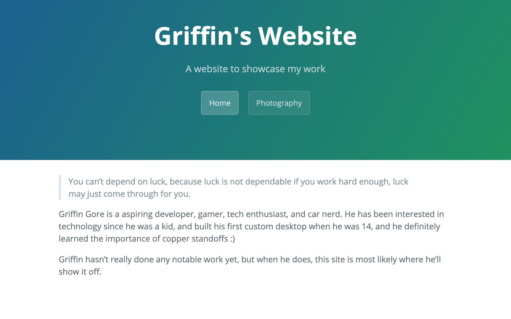

# Griffin's Website
> A website I created to showcase my work

I made this website as a central place to showcase my work, and as a homepage for all my other various social media and websites/projects. 

## Release History

* Pre-Alpha
    * Work in progress

## Meta

Griffin Gore – [@Ghgore_](https://twitter.com/Ghgore_)

Distributed under the CC0-1.0 license. See ``LICENSE`` for more information.

[https://github.com/ghgore/ghgore.github.io](https://github.com/ghgore/ghgore.github.io)

## Contributing

1. Fork it (<https://github.com/ghgore/ghgore.github.io/fork>)
2. Create your feature branch (`git checkout -b feature/fooBar`)
3. Commit your changes (`git commit -am 'Add some fooBar'`)
4. Push to the branch (`git push origin feature/fooBar`)
5. Create a new Pull Request

## Acknowledgments

* Cayman Theme for GitHub Pages (https://github.com/pages-themes/cayman)
* README template by dbader (https://github.com/dbader/readme-template/blob/master/README.md)

<!-- Markdown link & img dfn's -->
[wiki]: https://github.com/yourname/yourproject/wiki